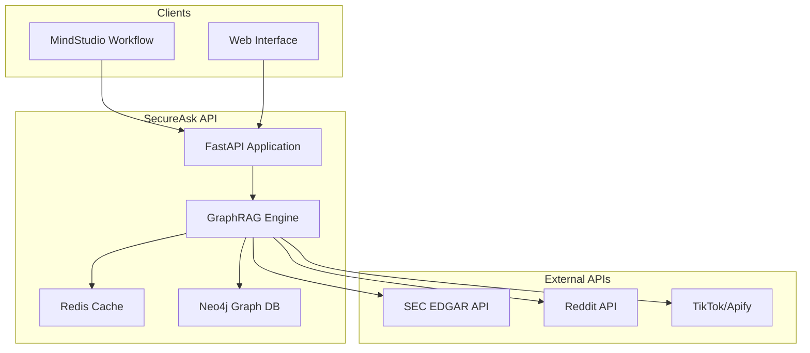

# SecureAsk GraphRAG API

[](https://mindstudio.ai)
[](https://python.org)
[](https://fastapi.tiangolo.com)
[](https://neo4j.com)

## 🎯 Project Overview

SecureAsk is a production-ready GraphRAG (Graph Retrieval-Augmented Generation) API that enables **governance-grade financial intelligence** by performing multi-hop reasoning across regulated documents and public sources **without copying data into a single vector store**.

### 🏆 Built for MindStudio.ai Hackathon

**The Challenge:** Create an AI system that can answer complex analyst questions by reasoning across multiple data sources while maintaining full audit trails and data governance compliance.

**Our Solution:** A graph-first RAG architecture that queries live data sources, builds knowledge graphs on-demand, and provides explainable answers with complete citation trails.

## 🚀 Key Features

### 🧠 Core GraphRAG Engine
- **Multi-hop reasoning** across heterogeneous data sources
- **Real-time data fetching** from SEC EDGAR, Reddit, and TikTok APIs
- **Graph-first architecture** using Neo4j for relationship modeling
- **Explainable AI** with complete citation trails and reasoning paths

### 🏭 Production-Ready Infrastructure
- **Redis caching layer** with intelligent TTL management
- **Rate limiting** with user tier support and sliding window algorithms
- **Structured logging** with request tracing and performance metrics
- **Health monitoring** for all service dependencies
- **Graceful degradation** when external services are unavailable

### 🔒 Governance & Compliance
- **Data-at-source** pattern - no permanent data copying
- **Full audit trails** with source attribution
- **Security filtering** for sensitive information in logs
- **API authentication** with JWT tokens (demo mode available)

## 🏗️ Architecture



### 🔄 Data Flow

1. **Query Processing**: Intelligent extraction of company tickers and search terms
2. **Graph Traversal**: Semantic search across existing knowledge graph
3. **Live Data Fetching**: Parallel API calls to external sources with caching
4. **Knowledge Synthesis**: GraphRAG reasoning with multi-source evidence
5. **Response Generation**: Structured answers with citations and confidence scores

## 📊 API Endpoints

### Core Query Endpoint

```http
POST /api/v1/query
Content-Type: application/json

{
    "question": "What are Apple's ESG risks?",
    "sources": ["sec", "reddit", "tiktok"],
    "max_hops": 2
}
```

**Response:**
```json
{
    "query_id": "uuid-string",
    "question": "What are Apple's ESG risks?",
    "status": "completed",
    "result": {
        "answer": "According to recent SEC filings, Apple faces...",
        "citations": [
            {
                "source": "sec",
                "url": "https://sec.gov/...",
                "snippet": "Apple Inc. faces several ESG risks...",
                "confidence": 0.95
            }
        ],
        "graph_path": ["query_analysis", "sec_filings", "synthesis"],
        "processing_time": 1847
    }
}
```

### Health Check

```http
GET /health
```

Returns detailed status of all service dependencies.

### Authentication (Demo)

```http
POST /api/v1/auth/demo
```

Generates demo JWT token for hackathon use.

## 🛠️ Setup & Installation

### Prerequisites

- Python 3.12+
- Neo4j Aura account (free tier available)
- Redis instance (optional, falls back gracefully)

### Local Development

1. **Clone and install dependencies:**
```bash
git clone <repository>
cd secureask
pip install -r requirements.txt
```

2. **Configure environment:**
```bash
# .env file
NEO4J_URI=neo4j+s://your-instance.databases.neo4j.io
NEO4J_USER=neo4j
NEO4J_PASSWORD=your-password
REDIS_URL=redis://localhost:6379  # Optional
LOG_LEVEL=INFO
ENVIRONMENT=development
```

3. **Run the API:**
```bash
python main.py
# Or with uvicorn:
uvicorn main:app --host 0.0.0.0 --port 8000 --reload
```

### Production Deployment

#### Replit (Current)
The live demo runs on Replit: https://c812e514-d8f5-42db-ad93-bbc36e2f406b-00-34xg5tvub1ese.picard.replit.dev

#### Other Platforms
- **Railway**: Docker containerization with auto-scaling
- **Render**: Direct Python deployment with managed databases  
- **AWS Lambda**: Serverless with container images
- **Vercel**: Edge functions for global distribution

## 📈 Performance & Monitoring

### Caching Strategy
- **Query Results**: 30-minute TTL for GraphRAG responses
- **SEC Data**: 1-hour TTL for regulatory filings
- **Social Media**: 15-minute TTL for Reddit/TikTok content

### Rate Limiting
```
Free Tier:    20 queries/minute
Pro Tier:     100 queries/minute  
Enterprise:   1000 queries/minute
```

### Monitoring
- **Request tracing** with unique IDs
- **Performance metrics** for all API calls
- **Cache hit/miss ratios**
- **External API response times**
- **Error tracking** with structured logging

## 🔧 Configuration

### Environment Variables

| Variable | Description | Default |
|----------|-------------|---------|
| `NEO4J_URI` | Neo4j connection string | Required |
| `NEO4J_USER` | Neo4j username | `neo4j` |
| `NEO4J_PASSWORD` | Neo4j password | Required |
| `REDIS_URL` | Redis connection string | `redis://localhost:6379` |
| `LOG_LEVEL` | Logging level | `INFO` |
| `ENVIRONMENT` | Environment (dev/prod) | `development` |

### Rate Limiting Configuration

Rate limits can be customized per endpoint and user tier in `middleware/rate_limit.py`:

```python
RATE_LIMITS = {
    "free": {"query": "20/minute"},
    "pro": {"query": "100/minute"},
    "enterprise": {"query": "1000/minute"}
}
```

## 🧪 Testing

### API Testing
```bash
# Health check
curl https://your-deployment/health

# Demo query
curl -X POST https://your-deployment/api/v1/query \
  -H "Content-Type: application/json" \
  -d '{"question": "What are Tesla ESG risks?", "sources": ["sec", "reddit"]}'
```

### Load Testing
The API includes built-in rate limiting and caching for production load handling.

## 🐛 Troubleshooting

### Common Issues

**Redis Connection Failed**
- API continues without caching
- Check `REDIS_URL` environment variable
- Verify Redis instance is accessible

**Neo4j Connection Error**
- Verify credentials in environment variables
- Check network connectivity to Neo4j Aura
- Ensure database is running

**Rate Limit Exceeded**
- Check rate limiting configuration
- Implement exponential backoff in clients
- Consider upgrading user tier

### Debug Mode
Set `LOG_LEVEL=DEBUG` for detailed request/response logging.

## 🚀 Live Demo

**API Endpoint:** https://c812e514-d8f5-42db-ad93-bbc36e2f406b-00-34xg5tvub1ese.picard.replit.dev

**Supported Companies:**
- Apple (AAPL), Tesla (TSLA), Microsoft (MSFT)
- Amazon (AMZN), Google (GOOGL), Meta (META)
- Nvidia (NVDA), Netflix (NFLX), Oracle (ORCL)

**Example Queries:**
- "What are Apple's climate change risks?"
- "How do retail investors view Tesla's supply chain?"
- "Compare Microsoft vs Google's ESG performance"

## 🏆 Hackathon Highlights

### Innovation
- **Graph-first RAG** architecture for multi-hop reasoning
- **Data-at-source** governance without vector store copying
- **Real-time synthesis** across regulated and social data

### Technical Excellence  
- **Production-ready** with caching, rate limiting, monitoring
- **Scalable architecture** with Redis and Neo4j
- **Comprehensive error handling** and graceful degradation

### Business Impact
- **Governance-grade compliance** for financial institutions
- **Explainable AI** with complete audit trails
- **Cost-effective** with intelligent caching and rate limiting

## 📝 License

MIT License - Built for MindStudio.ai Hackathon

## 🤝 Contributing

This is a hackathon project. For questions or collaboration:
- GitHub Issues for bug reports
- Direct contact for partnership opportunities

---

**🎉 Ready to explore governance-grade financial intelligence with SecureAsk!**