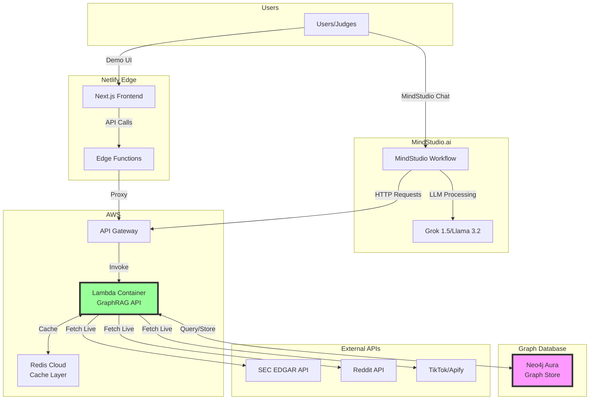
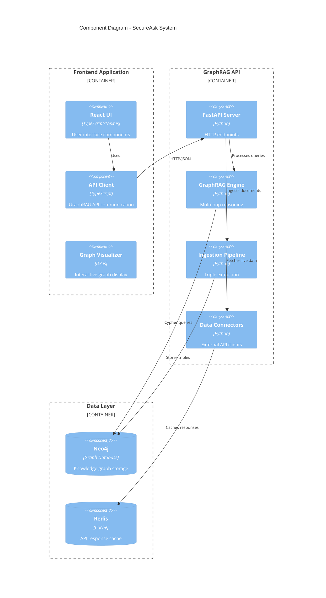
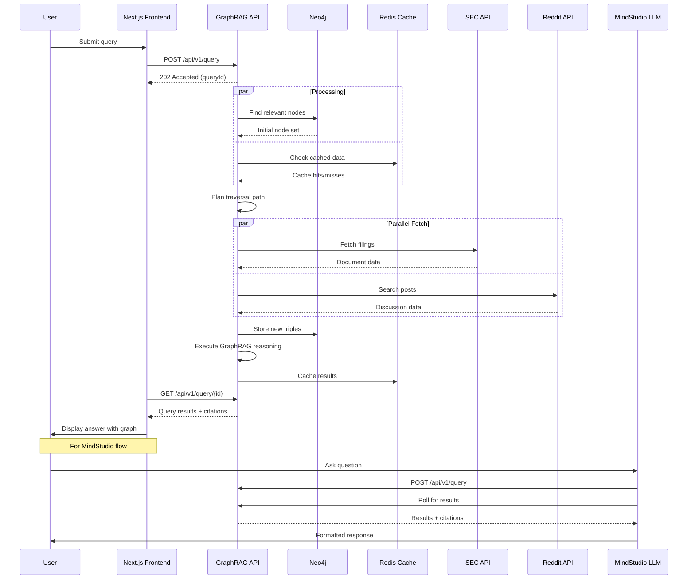
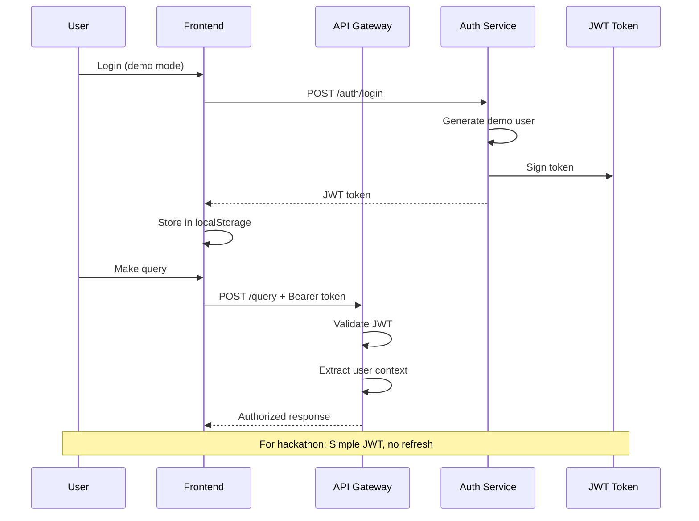
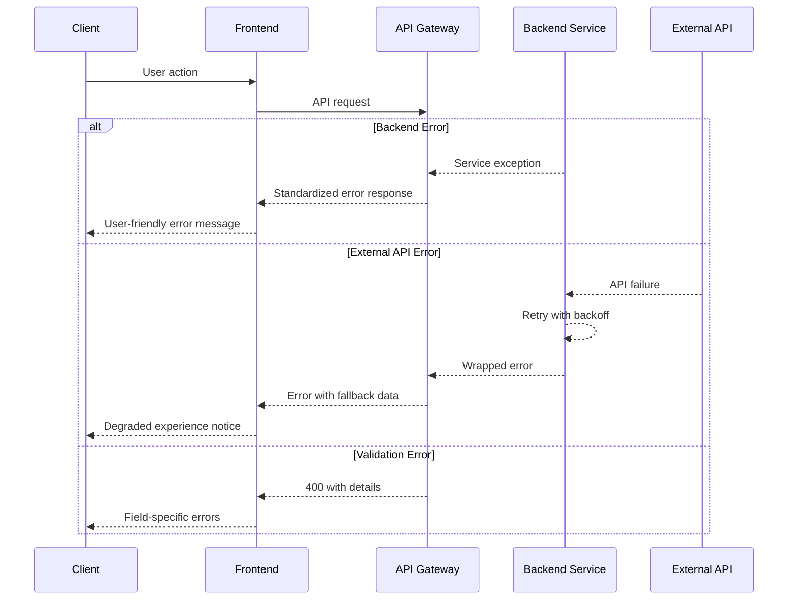

# SecureAsk Fullstack Architecture Document

## Introduction

This document outlines the complete fullstack architecture for SecureAsk, including backend systems, frontend implementation, and their integration. It serves as the single source of truth for AI-driven development, ensuring consistency across the entire technology stack.

This unified approach combines what would traditionally be separate backend and frontend architecture documents, streamlining the development process for modern fullstack applications where these concerns are increasingly intertwined.

### Starter Template or Existing Project

N/A - Greenfield project

### Change Log

| Date | Version | Description | Author |
|------|---------|-------------|--------|
| 2025-07-11 | 1.0 | Initial architecture document | Winston (Architect) |

## High Level Architecture

### Technical Summary

SecureAsk is a cloud-native, serverless GraphRAG system built on a modern JAMstack architecture with Next.js frontend and containerized GraphRAG API backend. The system leverages Neo4j Aura for graph storage, implements parallel data ingestion from SEC, Reddit, and TikTok APIs, and provides multi-hop reasoning capabilities through Microsoft's GraphRAG framework. The architecture prioritizes explainability with full citation trails, minimal data persistence for compliance, and sub-2-second query response times, all while maintaining a cost-effective infrastructure that scales to zero when idle.

### Platform and Infrastructure Choice

**Platform:** Netlify (Frontend) + AWS Lambda (GraphRAG API) + Neo4j Aura (Graph DB)
**Key Services:** Netlify Edge Functions, AWS Lambda with Container Images, Neo4j Aura Free Tier, Redis Cloud (caching)
**Deployment Host and Regions:** Netlify Global CDN, AWS us-east-1, Neo4j Aura us-east-1

### Repository Structure

**Structure:** Monorepo
**Monorepo Tool:** npm workspaces (simplest for hackathon timeline)
**Package Organization:** apps/ (web, api), packages/ (shared types, utils), infrastructure/ (minimal IaC)

### High Level Architecture Diagram



### Architectural Patterns

- **JAMstack Architecture:** Static frontend with serverless API backend - _Rationale:_ Optimal performance for demo day, scales to zero cost when idle
- **Graph-First Data Model:** All relationships stored as graph triples - _Rationale:_ Enables multi-hop reasoning that vector-only RAG cannot achieve
- **Lazy Data Fetching:** Only fetch external data on-demand during queries - _Rationale:_ Respects data governance requirements, minimizes API costs
- **Repository Pattern:** Abstract graph operations behind clean interfaces - _Rationale:_ Allows swapping between Neo4j/Neptune without breaking API contracts
- **Edge Caching:** Cache GraphRAG responses at Netlify edge - _Rationale:_ Sub-second response for repeated demo queries
- **Parallel External Fetching:** Concurrent API calls to SEC/Reddit/TikTok - _Rationale:_ Reduces total query latency from 3s to under 2s

## Tech Stack

### Technology Stack Table

| Category | Technology | Version | Purpose | Rationale |
|----------|------------|---------|---------|-----------|
| Frontend Language | TypeScript | 5.3+ | Type-safe development | Prevents runtime errors, better IDE support |
| Frontend Framework | Next.js | 14.2 | React framework with SSR/SSG | Netlify optimization, built-in API routes |
| UI Component Library | shadcn/ui | latest | Accessible components | Customizable, lightweight, Tailwind-based |
| State Management | Zustand | 4.5 | Client state management | Simple API, TypeScript support, minimal boilerplate |
| Backend Language | TypeScript | 5.3+ | Type-safe backend | Shared types with frontend, consistency |
| Backend Framework | FastAPI (Python) | 0.110 | GraphRAG API wrapper | Microsoft GraphRAG is Python-based |
| API Style | REST | - | Simple HTTP endpoints | Easier MindStudio integration than GraphQL |
| Database | Neo4j | 5.x | Graph database | Native graph operations for multi-hop queries |
| Cache | Redis Cloud | 7.2 | Query result caching | Free tier sufficient, managed service |
| File Storage | S3 | - | Document storage | Only for processed triples, not raw docs |
| Authentication | JWT | - | Stateless auth | Simple for hackathon, no session management |
| Frontend Testing | Vitest | 1.6 | Unit/integration tests | Fast, Jest-compatible, ESM support |
| Backend Testing | pytest | 8.0 | Python testing | Standard for FastAPI applications |
| E2E Testing | Playwright | 1.44 | Browser automation | Cross-browser testing for demo |
| Build Tool | Vite | 5.2 | Frontend bundling | Fast HMR, ESM-first |
| Bundler | esbuild | 0.20 | JS/TS bundling | Fastest bundler available |
| IaC Tool | AWS CDK | 2.140 | Infrastructure as code | Type-safe infrastructure |
| CI/CD | GitHub Actions | - | Automated deployment | Free for public repos |
| Monitoring | Netlify Analytics | - | Frontend monitoring | Built-in with Netlify |
| Logging | CloudWatch | - | Centralized logging | Native AWS integration |
| CSS Framework | Tailwind CSS | 3.4 | Utility-first CSS | Rapid styling, small bundle |

## Data Models

### User

**Purpose:** Represents system users (for demo purposes only)

**Key Attributes:**
- id: string - Unique identifier
- email: string - User email
- role: 'analyst' | 'compliance' | 'admin' - User role
- createdAt: Date - Account creation timestamp

**TypeScript Interface:**
```typescript
interface User {
  id: string;
  email: string;
  role: 'analyst' | 'compliance' | 'admin';
  createdAt: Date;
}
```

**Relationships:**
- Has many Queries
- Has many SavedGraphs

### Query

**Purpose:** Represents a user's question and its processing state

**Key Attributes:**
- id: string - Unique query ID
- userId: string - Owner of the query
- question: string - Natural language question
- status: 'pending' | 'processing' | 'completed' | 'failed' - Processing state
- createdAt: Date - Query timestamp
- completedAt: Date | null - Completion timestamp

**TypeScript Interface:**
```typescript
interface Query {
  id: string;
  userId: string;
  question: string;
  status: 'pending' | 'processing' | 'completed' | 'failed';
  createdAt: Date;
  completedAt: Date | null;
}
```

**Relationships:**
- Belongs to User
- Has one QueryResult
- Has many GraphNodes (traversed)

### QueryResult

**Purpose:** Stores the answer and citations for a completed query

**Key Attributes:**
- queryId: string - Associated query
- answer: string - Generated answer text
- citations: Citation[] - Array of sources
- graphPath: string[] - Node IDs traversed
- processingTime: number - Time in milliseconds

**TypeScript Interface:**
```typescript
interface QueryResult {
  queryId: string;
  answer: string;
  citations: Citation[];
  graphPath: string[];
  processingTime: number;
}

interface Citation {
  nodeId: string;
  source: 'sec' | 'reddit' | 'tiktok';
  url: string;
  snippet: string;
  confidence: number;
}
```

**Relationships:**
- Belongs to Query
- References many GraphNodes

### GraphNode

**Purpose:** Represents an entity in the knowledge graph

**Key Attributes:**
- id: string - Unique node identifier
- type: string - Entity type (Company, Risk, Topic, etc.)
- name: string - Display name
- properties: Record<string, any> - Flexible properties
- source: DataSource - Origin information
- createdAt: Date - When extracted

**TypeScript Interface:**
```typescript
interface GraphNode {
  id: string;
  type: string;
  name: string;
  properties: Record<string, any>;
  source: DataSource;
  createdAt: Date;
}

interface DataSource {
  type: 'sec' | 'reddit' | 'tiktok';
  documentId: string;
  url: string;
  extractedAt: Date;
}
```

**Relationships:**
- Connected to other GraphNodes via GraphEdges
- Referenced by QueryResults

### GraphEdge

**Purpose:** Represents relationships between entities

**Key Attributes:**
- id: string - Unique edge identifier
- fromNodeId: string - Source node
- toNodeId: string - Target node
- relationshipType: string - Type of relationship
- properties: Record<string, any> - Relationship metadata
- weight: number - Relationship strength

**TypeScript Interface:**
```typescript
interface GraphEdge {
  id: string;
  fromNodeId: string;
  toNodeId: string;
  relationshipType: string;
  properties: Record<string, any>;
  weight: number;
}
```

**Relationships:**
- Connects two GraphNodes

## API Specification

### REST API Specification

```yaml
openapi: 3.0.0
info:
  title: SecureAsk GraphRAG API
  version: 1.0.0
  description: Graph-based RAG API for multi-hop reasoning across financial documents
servers:
  - url: https://api.secureask.dev
    description: Production API

paths:
  /api/v1/query:
    post:
      summary: Submit a new query
      operationId: createQuery
      tags:
        - Queries
      security:
        - bearerAuth: []
      requestBody:
        required: true
        content:
          application/json:
            schema:
              type: object
              required:
                - question
              properties:
                question:
                  type: string
                  description: Natural language question
                  example: "What ESG risks did Apple and its suppliers flag last quarter?"
                maxHops:
                  type: integer
                  default: 2
                  minimum: 1
                  maximum: 3
                  description: Maximum graph traversal depth
                sources:
                  type: array
                  items:
                    type: string
                    enum: [sec, reddit, tiktok]
                  default: [sec, reddit, tiktok]
                  description: Data sources to include
      responses:
        '202':
          description: Query accepted for processing
          content:
            application/json:
              schema:
                type: object
                properties:
                  queryId:
                    type: string
                    format: uuid
                  status:
                    type: string
                    enum: [pending]
                  estimatedTime:
                    type: integer
                    description: Estimated processing time in seconds
        '400':
          $ref: '#/components/responses/BadRequest'
        '401':
          $ref: '#/components/responses/Unauthorized'

  /api/v1/query/{queryId}:
    get:
      summary: Get query status and results
      operationId: getQuery
      tags:
        - Queries
      security:
        - bearerAuth: []
      parameters:
        - name: queryId
          in: path
          required: true
          schema:
            type: string
            format: uuid
      responses:
        '200':
          description: Query details and results if completed
          content:
            application/json:
              schema:
                $ref: '#/components/schemas/QueryResponse'
        '404':
          $ref: '#/components/responses/NotFound'

  /api/v1/ingest:
    post:
      summary: Ingest a document into the graph
      operationId: ingestDocument
      tags:
        - Ingestion
      security:
        - bearerAuth: []
      requestBody:
        required: true
        content:
          application/json:
            schema:
              type: object
              required:
                - source
                - url
                - content
              properties:
                source:
                  type: string
                  enum: [sec, reddit, tiktok]
                url:
                  type: string
                  format: uri
                content:
                  type: string
                  description: Raw document content
                metadata:
                  type: object
                  additionalProperties: true
      responses:
        '200':
          description: Document ingested successfully
          content:
            application/json:
              schema:
                type: object
                properties:
                  documentId:
                    type: string
                  triplesExtracted:
                    type: integer
                  nodesCreated:
                    type: integer
                  edgesCreated:
                    type: integer

  /api/v1/graph/search:
    post:
      summary: Search graph nodes
      operationId: searchGraph
      tags:
        - Graph
      security:
        - bearerAuth: []
      requestBody:
        required: true
        content:
          application/json:
            schema:
              type: object
              properties:
                query:
                  type: string
                  description: Search query
                nodeType:
                  type: string
                  description: Filter by node type
                limit:
                  type: integer
                  default: 10
                  maximum: 100
      responses:
        '200':
          description: Search results
          content:
            application/json:
              schema:
                type: object
                properties:
                  nodes:
                    type: array
                    items:
                      $ref: '#/components/schemas/GraphNode'
                  totalCount:
                    type: integer

components:
  securitySchemes:
    bearerAuth:
      type: http
      scheme: bearer
      bearerFormat: JWT

  schemas:
    QueryResponse:
      type: object
      properties:
        queryId:
          type: string
          format: uuid
        question:
          type: string
        status:
          type: string
          enum: [pending, processing, completed, failed]
        result:
          type: object
          nullable: true
          properties:
            answer:
              type: string
            citations:
              type: array
              items:
                $ref: '#/components/schemas/Citation'
            graphPath:
              type: array
              items:
                type: string
            processingTime:
              type: integer
        createdAt:
          type: string
          format: date-time
        completedAt:
          type: string
          format: date-time
          nullable: true

    Citation:
      type: object
      properties:
        nodeId:
          type: string
        source:
          type: string
          enum: [sec, reddit, tiktok]
        url:
          type: string
          format: uri
        snippet:
          type: string
        confidence:
          type: number
          minimum: 0
          maximum: 1

    GraphNode:
      type: object
      properties:
        id:
          type: string
        type:
          type: string
        name:
          type: string
        properties:
          type: object
          additionalProperties: true
        source:
          type: object
          properties:
            type:
              type: string
              enum: [sec, reddit, tiktok]
            documentId:
              type: string
            url:
              type: string
              format: uri

    Error:
      type: object
      properties:
        error:
          type: object
          properties:
            code:
              type: string
            message:
              type: string
            details:
              type: object
              additionalProperties: true
            timestamp:
              type: string
              format: date-time
            requestId:
              type: string

  responses:
    BadRequest:
      description: Bad request
      content:
        application/json:
          schema:
            $ref: '#/components/schemas/Error'
    
    Unauthorized:
      description: Unauthorized
      content:
        application/json:
          schema:
            $ref: '#/components/schemas/Error'
    
    NotFound:
      description: Not found
      content:
        application/json:
          schema:
            $ref: '#/components/schemas/Error'
```

## Components

### Frontend Application (Next.js)

**Responsibility:** User interface for demo, query submission, and result visualization

**Key Interfaces:**
- Query submission form
- Real-time query status updates
- Interactive graph visualization
- Citation display with source links

**Dependencies:** GraphRAG API, Netlify Edge Functions

**Technology Stack:** Next.js 14.2, React 18, TypeScript, Tailwind CSS, D3.js for graph viz

### GraphRAG API Service

**Responsibility:** Core reasoning engine, graph operations, and external data orchestration

**Key Interfaces:**
- POST /api/v1/query - Submit queries
- GET /api/v1/query/{id} - Get results
- POST /api/v1/ingest - Add documents
- POST /api/v1/graph/search - Search nodes

**Dependencies:** Neo4j, Redis, External APIs

**Technology Stack:** Python FastAPI, Microsoft GraphRAG, Neo4j Python driver, Redis-py

### Graph Database Layer

**Responsibility:** Store and query knowledge graph triples

**Key Interfaces:**
- Cypher query interface
- Bulk import/export
- Graph traversal algorithms
- Index management

**Dependencies:** None (base layer)

**Technology Stack:** Neo4j Aura 5.x, APOC procedures for advanced operations

### External Data Connectors

**Responsibility:** Fetch and normalize data from SEC, Reddit, and TikTok

**Key Interfaces:**
- Standardized fetch(url) interface
- Rate limiting and retry logic
- Response normalization
- Error handling

**Dependencies:** External API credentials, Redis cache

**Technology Stack:** Python aiohttp, Beautiful Soup for parsing, Pydantic for validation

### Cache Layer

**Responsibility:** Cache external API responses and query results

**Key Interfaces:**
- Key-value store
- TTL management
- Invalidation patterns
- Memory limits

**Dependencies:** None

**Technology Stack:** Redis Cloud free tier, 30MB limit, 15-minute TTL for demo

### Component Diagrams



## External APIs

### SEC EDGAR API

- **Purpose:** Fetch company filings (10-K, 10-Q, 8-K) for ESG and financial data
- **Documentation:** https://www.sec.gov/edgar/sec-api-documentation
- **Base URL(s):** https://data.sec.gov/
- **Authentication:** None required, but must include User-Agent header
- **Rate Limits:** 10 requests per second

**Key Endpoints Used:**
- `GET /submissions/CIK{cik}.json` - Get company submission history
- `GET /Archives/edgar/data/{cik}/{accession}/{file}` - Fetch specific filing

**Integration Notes:** Parse XBRL for structured data extraction; implement polite crawling with delays

### Reddit API

- **Purpose:** Gather market sentiment and retail investor discussions
- **Documentation:** https://www.reddit.com/dev/api/
- **Base URL(s):** https://oauth.reddit.com/
- **Authentication:** OAuth2 with client credentials
- **Rate Limits:** 60 requests per minute for OAuth apps

**Key Endpoints Used:**
- `GET /r/{subreddit}/search` - Search posts in specific subreddits
- `GET /api/v1/me` - Verify authentication
- `GET /comments/{id}` - Fetch comment threads

**Integration Notes:** Focus on finance-related subreddits; implement sentiment analysis on comments

### TikTok (via Apify) API

- **Purpose:** Capture trending financial content and creator sentiment
- **Documentation:** https://apify.com/apify/tiktok-scraper
- **Base URL(s):** https://api.apify.com/v2/
- **Authentication:** API token
- **Rate Limits:** Based on Apify credits

**Key Endpoints Used:**
- `POST /acts/apify~tiktok-scraper/runs` - Start scraping job
- `GET /acts/apify~tiktok-scraper/runs/{runId}` - Check job status
- `GET /datasets/{datasetId}/items` - Fetch scraped data

**Integration Notes:** Budget $5-10 for demo; focus on finance/business hashtags; extract creator insights

## Core Workflows



## Database Schema

```sql
-- Neo4j Cypher Schema (Conceptual - Neo4j doesn't use traditional DDL)

-- Node Types
CREATE CONSTRAINT company_id IF NOT EXISTS 
FOR (c:Company) REQUIRE c.id IS UNIQUE;

CREATE CONSTRAINT risk_id IF NOT EXISTS 
FOR (r:Risk) REQUIRE r.id IS UNIQUE;

CREATE CONSTRAINT topic_id IF NOT EXISTS 
FOR (t:Topic) REQUIRE t.id IS UNIQUE;

CREATE CONSTRAINT document_id IF NOT EXISTS 
FOR (d:Document) REQUIRE d.id IS UNIQUE;

CREATE CONSTRAINT person_id IF NOT EXISTS 
FOR (p:Person) REQUIRE p.id IS UNIQUE;

-- Example Node Structures
// Company Node
(:Company {
  id: 'company_AAPL',
  name: 'Apple Inc.',
  ticker: 'AAPL',
  cik: '0000320193',
  sector: 'Technology',
  lastUpdated: datetime()
})

// Risk Node  
(:Risk {
  id: 'risk_climate_001',
  type: 'ESG',
  category: 'Climate',
  description: 'Supply chain climate exposure',
  severity: 'HIGH',
  identifiedDate: date()
})

// Document Node
(:Document {
  id: 'doc_sec_10k_2024',
  source: 'sec',
  type: '10-K',
  url: 'https://...',
  publishedDate: date(),
  extractedDate: datetime()
})

-- Relationship Types
// Company discusses Risk in Document
(:Company)-[:DISCUSSES {
  context: 'Risk factors section',
  confidence: 0.95,
  page: 47
}]->(:Risk)

// Risk mentioned in Document
(:Risk)-[:MENTIONED_IN {
  snippet: 'climate-related supply chain...',
  sentiment: 'negative'
}]->(:Document)

// Company has Supplier Company
(:Company)-[:HAS_SUPPLIER {
  tier: 1,
  category: 'Components',
  since: date('2020-01-01')
}]->(:Company)

// Person (Creator) discusses Company
(:Person)-[:DISCUSSES {
  platform: 'tiktok',
  videoId: 'xyz123',
  viewCount: 50000,
  sentiment: 'bearish'
}]->(:Company)

-- Indexes for Performance
CREATE INDEX company_ticker IF NOT EXISTS 
FOR (c:Company) ON (c.ticker);

CREATE INDEX risk_type IF NOT EXISTS 
FOR (r:Risk) ON (r.type);

CREATE INDEX document_date IF NOT EXISTS 
FOR (d:Document) ON (d.publishedDate);

CREATE FULLTEXT INDEX company_search IF NOT EXISTS 
FOR (c:Company) ON EACH [c.name, c.description];
```

## Frontend Architecture

### Component Architecture

#### Component Organization

```text
apps/web/src/
├── components/
│   ├── ui/              # shadcn/ui components
│   │   ├── button.tsx
│   │   ├── card.tsx
│   │   └── dialog.tsx
│   ├── query/           # Query-related components
│   │   ├── QueryForm.tsx
│   │   ├── QueryStatus.tsx
│   │   └── QueryHistory.tsx
│   ├── graph/           # Graph visualization
│   │   ├── GraphViewer.tsx
│   │   ├── NodeDetails.tsx
│   │   └── GraphControls.tsx
│   ├── results/         # Results display
│   │   ├── AnswerCard.tsx
│   │   ├── CitationList.tsx
│   │   └── SourceBadge.tsx
│   └── layout/          # Layout components
│       ├── Header.tsx
│       ├── Footer.tsx
│       └── Navigation.tsx
├── hooks/               # Custom React hooks
│   ├── useQuery.ts
│   ├── useGraphData.ts
│   └── useWebSocket.ts
├── lib/                 # Utilities
│   ├── api-client.ts
│   ├── graph-utils.ts
│   └── constants.ts
└── app/                 # Next.js app directory
    ├── layout.tsx
    ├── page.tsx
    └── netlify/
        └── edge-functions/
            └── api-proxy.ts
```

#### Component Template

```typescript
// components/query/QueryForm.tsx
'use client';

import { useState } from 'react';
import { useMutation } from '@tanstack/react-query';
import { Button } from '@/components/ui/button';
import { Textarea } from '@/components/ui/textarea';
import { Card } from '@/components/ui/card';
import { api } from '@/lib/api-client';
import type { QueryRequest } from '@secureask/shared';

interface QueryFormProps {
  onQuerySubmit: (queryId: string) => void;
}

export function QueryForm({ onQuerySubmit }: QueryFormProps) {
  const [question, setQuestion] = useState('');
  
  const submitQuery = useMutation({
    mutationFn: (data: QueryRequest) => api.queries.create(data),
    onSuccess: (response) => {
      onQuerySubmit(response.queryId);
      setQuestion('');
    },
  });

  const handleSubmit = (e: React.FormEvent) => {
    e.preventDefault();
    if (question.trim()) {
      submitQuery.mutate({ question });
    }
  };

  return (
    <Card className="p-6">
      <form onSubmit={handleSubmit}>
        <Textarea
          placeholder="Ask about ESG risks, compliance issues, or market sentiment..."
          value={question}
          onChange={(e) => setQuestion(e.target.value)}
          className="min-h-[100px] mb-4"
        />
        <Button 
          type="submit" 
          disabled={!question.trim() || submitQuery.isPending}
          className="w-full"
        >
          {submitQuery.isPending ? 'Processing...' : 'Ask SecureAsk'}
        </Button>
      </form>
    </Card>
  );
}
```

### State Management Architecture

#### State Structure

```typescript
// stores/query.store.ts
import { create } from 'zustand';
import { devtools, persist } from 'zustand/middleware';
import type { Query, QueryResult } from '@secureask/shared';

interface QueryState {
  // State
  queries: Map<string, Query>;
  activeQueryId: string | null;
  results: Map<string, QueryResult>;
  
  // Actions
  addQuery: (query: Query) => void;
  updateQueryStatus: (queryId: string, status: Query['status']) => void;
  setResult: (queryId: string, result: QueryResult) => void;
  setActiveQuery: (queryId: string | null) => void;
  clearHistory: () => void;
}

export const useQueryStore = create<QueryState>()(
  devtools(
    persist(
      (set) => ({
        queries: new Map(),
        activeQueryId: null,
        results: new Map(),
        
        addQuery: (query) =>
          set((state) => ({
            queries: new Map(state.queries).set(query.id, query),
            activeQueryId: query.id,
          })),
          
        updateQueryStatus: (queryId, status) =>
          set((state) => {
            const query = state.queries.get(queryId);
            if (query) {
              const updated = new Map(state.queries);
              updated.set(queryId, { ...query, status });
              return { queries: updated };
            }
            return state;
          }),
          
        setResult: (queryId, result) =>
          set((state) => ({
            results: new Map(state.results).set(queryId, result),
          })),
          
        setActiveQuery: (queryId) =>
          set({ activeQueryId: queryId }),
          
        clearHistory: () =>
          set({ queries: new Map(), results: new Map(), activeQueryId: null }),
      }),
      {
        name: 'secureask-queries',
        partialize: (state) => ({
          queries: Array.from(state.queries.entries()),
          results: Array.from(state.results.entries()),
        }),
      }
    )
  )
);
```

#### State Management Patterns

- **Atomic Updates:** All state changes are immutable operations
- **Optimistic UI:** Update UI immediately, reconcile with server response
- **Persistence:** Save query history to localStorage for demo continuity
- **WebSocket Sync:** Real-time updates for query processing status
- **Error Boundaries:** Graceful error handling with fallback UI

### Routing Architecture

#### Route Organization

```text
app/
├── (main)/
│   ├── layout.tsx       # Main app layout
│   ├── page.tsx         # Home/Query page
│   ├── results/
│   │   └── [queryId]/
│   │       └── page.tsx # Results display
│   └── graph/
│       └── page.tsx     # Graph explorer
├── (auth)/
│   ├── layout.tsx       # Auth layout
│   └── login/
│       └── page.tsx     # Login (if needed)
├── netlify/
│   └── edge-functions/
│       └── api-proxy.ts # API proxy
└── layout.tsx           # Root layout
```

#### Protected Route Pattern

```typescript
// middleware.ts
import { NextResponse } from 'next/server';
import type { NextRequest } from 'next/server';
import { verifyToken } from '@/lib/auth';

export async function middleware(request: NextRequest) {
  // For hackathon, minimal auth
  const token = request.cookies.get('auth-token');
  
  if (request.nextUrl.pathname.startsWith('/api/proxy')) {
    // Add auth header for backend
    const headers = new Headers(request.headers);
    if (token) {
      headers.set('Authorization', `Bearer ${token.value}`);
    }
    
    return NextResponse.next({
      request: { headers },
    });
  }
  
  return NextResponse.next();
}

export const config = {
  matcher: ['/api/proxy/:path*', '/(main)/:path*'],
};
```

### Frontend Services Layer

#### API Client Setup

```typescript
// lib/api-client.ts
import ky from 'ky';
import type { 
  QueryRequest, 
  QueryResponse, 
  IngestRequest,
  GraphSearchRequest,
  GraphSearchResponse 
} from '@secureask/shared';

const client = ky.create({
  prefixUrl: process.env.NEXT_PUBLIC_API_URL || '/api/proxy',
  timeout: 30000,
  hooks: {
    beforeRequest: [
      (request) => {
        const token = localStorage.getItem('auth-token');
        if (token) {
          request.headers.set('Authorization', `Bearer ${token}`);
        }
      },
    ],
    afterResponse: [
      async (request, options, response) => {
        if (!response.ok) {
          const error = await response.json();
          throw new Error(error.message || 'API Error');
        }
      },
    ],
  },
});

export const api = {
  queries: {
    create: (data: QueryRequest) =>
      client.post('v1/query', { json: data }).json<{ queryId: string }>(),
      
    get: (queryId: string) =>
      client.get(`v1/query/${queryId}`).json<QueryResponse>(),
      
    poll: async (queryId: string, onUpdate?: (response: QueryResponse) => void) => {
      let attempts = 0;
      const maxAttempts = 60; // 1 minute timeout
      
      while (attempts < maxAttempts) {
        const response = await api.queries.get(queryId);
        
        if (onUpdate) onUpdate(response);
        
        if (response.status === 'completed' || response.status === 'failed') {
          return response;
        }
        
        await new Promise(resolve => setTimeout(resolve, 1000));
        attempts++;
      }
      
      throw new Error('Query timeout');
    },
  },
  
  graph: {
    search: (data: GraphSearchRequest) =>
      client.post('v1/graph/search', { json: data }).json<GraphSearchResponse>(),
  },
  
  ingest: {
    document: (data: IngestRequest) =>
      client.post('v1/ingest', { json: data }).json<{ documentId: string }>(),
  },
};
```

#### Service Example

```typescript
// services/query.service.ts
import { api } from '@/lib/api-client';
import { useQueryStore } from '@/stores/query.store';
import { useToast } from '@/components/ui/use-toast';

export class QueryService {
  static async submitAndTrack(question: string) {
    const { addQuery, updateQueryStatus, setResult } = useQueryStore.getState();
    const { toast } = useToast();
    
    try {
      // Create query
      const { queryId } = await api.queries.create({ question });
      
      // Add to store
      addQuery({
        id: queryId,
        userId: 'demo',
        question,
        status: 'pending',
        createdAt: new Date(),
        completedAt: null,
      });
      
      // Poll for results
      const result = await api.queries.poll(queryId, (update) => {
        updateQueryStatus(queryId, update.status);
      });
      
      if (result.status === 'completed' && result.result) {
        setResult(queryId, result.result);
        toast({
          title: 'Query Complete',
          description: `Found ${result.result.citations.length} sources`,
        });
      } else {
        throw new Error('Query failed');
      }
      
      return result;
    } catch (error) {
      toast({
        title: 'Query Failed',
        description: error.message,
        variant: 'destructive',
      });
      throw error;
    }
  }
}
```

## Backend Architecture

### Service Architecture

#### Function Organization

```text
apps/api/src/
├── functions/           # Lambda function handlers
│   ├── query/
│   │   ├── handler.py   # Query endpoint
│   │   └── processor.py # Query processing logic
│   ├── ingest/
│   │   ├── handler.py   # Ingest endpoint
│   │   └── extractor.py # Triple extraction
│   └── graph/
│       ├── handler.py   # Graph operations
│       └── search.py    # Graph search logic
├── core/               # Core GraphRAG logic
│   ├── graphrag/
│   │   ├── engine.py   # Main reasoning engine
│   │   ├── traversal.py # Graph traversal
│   │   └── synthesis.py # Answer synthesis
│   ├── models/         # Data models
│   │   ├── graph.py
│   │   ├── query.py
│   │   └── document.py
│   └── config.py       # Configuration
├── connectors/         # External data connectors
│   ├── sec.py
│   ├── reddit.py
│   └── tiktok.py
├── db/                 # Database layer
│   ├── neo4j.py
│   └── redis.py
└── main.py            # FastAPI app entry
```

#### Function Template

```python
# functions/query/handler.py
import json
from typing import Dict, Any
from aws_lambda_powertools import Logger, Tracer, Metrics
from aws_lambda_powertools.metrics import MetricUnit
from aws_lambda_powertools.utilities.typing import LambdaContext

from core.graphrag import GraphRAGEngine
from core.models import QueryRequest, QueryResponse
from db.redis import RedisCache

logger = Logger()
tracer = Tracer()
metrics = Metrics()

@logger.inject_lambda_context
@tracer.capture_lambda_handler
@metrics.log_metrics
def handler(event: Dict[str, Any], context: LambdaContext) -> Dict[str, Any]:
    """Lambda handler for query processing"""
    
    try:
        # Parse request
        body = json.loads(event.get('body', '{}'))
        request = QueryRequest(**body)
        
        # Check cache
        cache = RedisCache()
        cache_key = f"query:{request.question_hash()}"
        cached = cache.get(cache_key)
        
        if cached:
            metrics.add_metric(name="CacheHit", unit=MetricUnit.Count, value=1)
            return {
                'statusCode': 200,
                'body': json.dumps(cached),
                'headers': {'Content-Type': 'application/json'}
            }
        
        # Process query
        engine = GraphRAGEngine()
        result = engine.process_query(
            question=request.question,
            max_hops=request.max_hops,
            sources=request.sources
        )
        
        # Cache result
        cache.set(cache_key, result.dict(), ttl=900)  # 15 min cache
        
        metrics.add_metric(name="QueryProcessed", unit=MetricUnit.Count, value=1)
        metrics.add_metric(name="ProcessingTime", unit=MetricUnit.Milliseconds, 
                          value=result.processing_time)
        
        return {
            'statusCode': 200,
            'body': json.dumps(result.dict()),
            'headers': {'Content-Type': 'application/json'}
        }
        
    except Exception as e:
        logger.exception("Query processing failed")
        metrics.add_metric(name="QueryError", unit=MetricUnit.Count, value=1)
        
        return {
            'statusCode': 500,
            'body': json.dumps({
                'error': {
                    'code': 'INTERNAL_ERROR',
                    'message': str(e),
                    'requestId': context.request_id
                }
            }),
            'headers': {'Content-Type': 'application/json'}
        }
```

### Database Architecture

#### Schema Design

```sql
-- Using Cypher for Neo4j schema definition
-- Note: This is conceptual - Neo4j uses property graph model

-- Constraints ensure uniqueness and enable indexing
CREATE CONSTRAINT unique_company_id IF NOT EXISTS 
FOR (c:Company) REQUIRE c.id IS UNIQUE;

CREATE CONSTRAINT unique_risk_id IF NOT EXISTS 
FOR (r:Risk) REQUIRE r.id IS UNIQUE;

CREATE CONSTRAINT unique_document_id IF NOT EXISTS 
FOR (d:Document) REQUIRE d.id IS UNIQUE;

CREATE CONSTRAINT unique_topic_id IF NOT EXISTS 
FOR (t:Topic) REQUIRE t.id IS UNIQUE;

CREATE CONSTRAINT unique_person_id IF NOT EXISTS 
FOR (p:Person) REQUIRE p.id IS UNIQUE;

-- Full-text search indexes
CREATE FULLTEXT INDEX company_search IF NOT EXISTS 
FOR (n:Company) ON EACH [n.name, n.description];

CREATE FULLTEXT INDEX risk_search IF NOT EXISTS 
FOR (n:Risk) ON EACH [n.description, n.category];

-- Property indexes for common queries
CREATE INDEX company_ticker IF NOT EXISTS FOR (c:Company) ON (c.ticker);
CREATE INDEX document_date IF NOT EXISTS FOR (d:Document) ON (d.publishedDate);
CREATE INDEX risk_severity IF NOT EXISTS FOR (r:Risk) ON (r.severity);

-- Composite indexes for complex queries
CREATE INDEX company_sector_updated IF NOT EXISTS 
FOR (c:Company) ON (c.sector, c.lastUpdated);
```

#### Data Access Layer

```python
# db/neo4j.py
from typing import List, Dict, Any, Optional
from neo4j import AsyncGraphDatabase, AsyncSession
from neo4j.exceptions import Neo4jError
import asyncio
from contextlib import asynccontextmanager

from core.config import settings
from core.models.graph import GraphNode, GraphEdge, GraphPath

class Neo4jRepository:
    """Repository pattern for Neo4j operations"""
    
    def __init__(self):
        self._driver = AsyncGraphDatabase.driver(
            settings.NEO4J_URI,
            auth=(settings.NEO4J_USER, settings.NEO4J_PASSWORD),
            max_connection_pool_size=50
        )
    
    @asynccontextmanager
    async def session(self) -> AsyncSession:
        """Provide a transactional scope around operations"""
        async with self._driver.session() as session:
            yield session
    
    async def close(self):
        """Close the driver connection"""
        await self._driver.close()
    
    async def find_related_nodes(
        self,
        start_node_id: str,
        relationship_types: List[str],
        max_hops: int = 2,
        node_filters: Optional[Dict[str, Any]] = None
    ) -> List[GraphPath]:
        """Find nodes related to start node within max_hops"""
        
        # Build dynamic Cypher query
        rel_pattern = '|'.join(f':{rt}' for rt in relationship_types)
        hop_pattern = f'*1..{max_hops}'
        
        query = f"""
        MATCH path = (start:Node {{id: $start_id}})-[{rel_pattern}{hop_pattern}]-(end:Node)
        WHERE start <> end
        """
        
        if node_filters:
            conditions = ' AND '.join(
                f'end.{key} = ${key}' for key in node_filters
            )
            query += f' AND {conditions}'
        
        query += """
        RETURN path
        ORDER BY length(path)
        LIMIT 100
        """
        
        async with self.session() as session:
            result = await session.run(
                query,
                start_id=start_node_id,
                **node_filters or {}
            )
            
            paths = []
            async for record in result:
                path = record['path']
                paths.append(self._parse_path(path))
            
            return paths
    
    async def create_triple(
        self,
        subject: GraphNode,
        predicate: str,
        object: GraphNode,
        properties: Optional[Dict[str, Any]] = None
    ) -> GraphEdge:
        """Create a triple (subject-predicate-object) in the graph"""
        
        query = """
        MERGE (s:Node {id: $subject_id})
        SET s += $subject_props
        MERGE (o:Node {id: $object_id})
        SET o += $object_props
        MERGE (s)-[r:RELATES {type: $predicate}]->(o)
        SET r += $rel_props
        RETURN r
        """
        
        async with self.session() as session:
            result = await session.run(
                query,
                subject_id=subject.id,
                subject_props=subject.dict(exclude={'id'}),
                object_id=object.id,
                object_props=object.dict(exclude={'id'}),
                predicate=predicate,
                rel_props=properties or {}
            )
            
            record = await result.single()
            return self._parse_relationship(record['r'])
    
    async def search_nodes(
        self,
        query_text: str,
        node_type: Optional[str] = None,
        limit: int = 10
    ) -> List[GraphNode]:
        """Full-text search across nodes"""
        
        if node_type:
            search_query = f"""
            CALL db.index.fulltext.queryNodes('{node_type.lower()}_search', $query)
            YIELD node, score
            WHERE node:{node_type}
            RETURN node, score
            ORDER BY score DESC
            LIMIT $limit
            """
        else:
            # Search across all node types
            search_query = """
            CALL db.index.fulltext.queryNodes('all_nodes_search', $query)
            YIELD node, score
            RETURN node, score
            ORDER BY score DESC
            LIMIT $limit
            """
        
        async with self.session() as session:
            result = await session.run(
                search_query,
                query=query_text,
                limit=limit
            )
            
            nodes = []
            async for record in result:
                node = self._parse_node(record['node'])
                node.search_score = record['score']
                nodes.append(node)
            
            return nodes
    
    def _parse_node(self, neo4j_node) -> GraphNode:
        """Convert Neo4j node to domain model"""
        labels = list(neo4j_node.labels)
        props = dict(neo4j_node)
        
        return GraphNode(
            id=props.pop('id'),
            type=labels[0] if labels else 'Node',
            name=props.get('name', ''),
            properties=props,
            source=props.get('source', {})
        )
    
    def _parse_relationship(self, neo4j_rel) -> GraphEdge:
        """Convert Neo4j relationship to domain model"""
        props = dict(neo4j_rel)
        
        return GraphEdge(
            id=neo4j_rel.id,
            fromNodeId=neo4j_rel.start_node.id,
            toNodeId=neo4j_rel.end_node.id,
            relationshipType=neo4j_rel.type,
            properties=props,
            weight=props.get('weight', 1.0)
        )
    
    def _parse_path(self, neo4j_path) -> GraphPath:
        """Convert Neo4j path to domain model"""
        nodes = [self._parse_node(node) for node in neo4j_path.nodes]
        edges = [self._parse_relationship(rel) for rel in neo4j_path.relationships]
        
        return GraphPath(
            nodes=nodes,
            edges=edges,
            length=len(neo4j_path)
        )
```

### Authentication and Authorization

#### Auth Flow



#### Middleware/Guards

```python
# middleware/auth.py
from typing import Optional
from fastapi import HTTPException, Request, Security
from fastapi.security import HTTPBearer, HTTPAuthorizationCredentials
import jwt
from datetime import datetime, timedelta

from core.config import settings

security = HTTPBearer()

class AuthMiddleware:
    """JWT authentication middleware"""
    
    @staticmethod
    def create_token(user_id: str, role: str = "analyst") -> str:
        """Create a JWT token"""
        payload = {
            "sub": user_id,
            "role": role,
            "exp": datetime.utcnow() + timedelta(hours=24),
            "iat": datetime.utcnow()
        }
        
        return jwt.encode(
            payload,
            settings.JWT_SECRET,
            algorithm="HS256"
        )
    
    @staticmethod
    async def verify_token(
        credentials: HTTPAuthorizationCredentials = Security(security)
    ) -> dict:
        """Verify and decode JWT token"""
        token = credentials.credentials
        
        try:
            payload = jwt.decode(
                token,
                settings.JWT_SECRET,
                algorithms=["HS256"]
            )
            
            return {
                "user_id": payload["sub"],
                "role": payload.get("role", "analyst")
            }
            
        except jwt.ExpiredSignatureError:
            raise HTTPException(
                status_code=401,
                detail="Token expired"
            )
        except jwt.InvalidTokenError:
            raise HTTPException(
                status_code=401,
                detail="Invalid token"
            )
    
    @staticmethod
    def require_role(required_role: str):
        """Decorator to require specific role"""
        def decorator(func):
            async def wrapper(*args, user: dict = Security(verify_token), **kwargs):
                if user.get("role") != required_role:
                    raise HTTPException(
                        status_code=403,
                        detail=f"Role '{required_role}' required"
                    )
                return await func(*args, user=user, **kwargs)
            return wrapper
        return decorator

# Usage in endpoints
from fastapi import APIRouter, Depends
from middleware.auth import AuthMiddleware

router = APIRouter()

@router.post("/api/v1/query")
async def create_query(
    request: QueryRequest,
    user: dict = Depends(AuthMiddleware.verify_token)
):
    """Create a new query - requires authentication"""
    # User context available here
    return await process_query(request, user_id=user["user_id"])

@router.post("/api/v1/admin/ingest")
@AuthMiddleware.require_role("admin")
async def admin_ingest(
    request: IngestRequest,
    user: dict
):
    """Admin-only endpoint for manual ingestion"""
    return await ingest_document(request)
```

## Unified Project Structure

```plaintext
secureask/
├── .github/                    # CI/CD workflows
│   └── workflows/
│       ├── ci.yaml
│       └── deploy.yaml
├── apps/                       # Application packages
│   ├── web/                    # Frontend application
│   │   ├── src/
│   │   │   ├── components/     # UI components
│   │   │   ├── app/           # Next.js app directory
│   │   │   ├── hooks/          # Custom React hooks
│   │   │   ├── services/       # API client services
│   │   │   ├── stores/         # Zustand stores
│   │   │   ├── styles/         # Global styles/themes
│   │   │   └── lib/           # Frontend utilities
│   │   ├── public/             # Static assets
│   │   ├── tests/              # Frontend tests
│   │   └── package.json
│   └── api/                    # Backend application
│       ├── src/
│       │   ├── functions/      # Lambda handlers
│       │   ├── core/           # Business logic
│       │   ├── connectors/     # External APIs
│       │   ├── db/             # Database layer
│       │   ├── middleware/     # Auth/error handling
│       │   └── main.py         # FastAPI entry
│       ├── tests/              # Backend tests
│       ├── Dockerfile          # Container definition
│       └── requirements.txt
├── packages/                   # Shared packages
│   ├── shared/                 # Shared types/utilities
│   │   ├── src/
│   │   │   ├── types/          # TypeScript interfaces
│   │   │   ├── constants/      # Shared constants
│   │   │   └── utils/          # Shared utilities
│   │   └── package.json
│   └── config/                 # Shared configuration
│       ├── eslint/
│       ├── typescript/
│       └── jest/
├── infrastructure/             # IaC definitions
│   ├── cdk/
│   │   ├── lib/
│   │   │   └── api-stack.ts   # API Gateway + Lambda
│   │   └── app.ts
│   ├── terraform/              # Alternative to CDK
│   └── netlify.toml           # Netlify configuration
├── scripts/                    # Build/deploy scripts
│   ├── setup.sh               # Initial setup
│   ├── deploy.sh              # Deployment script
│   └── seed-graph.py          # Graph seeding
├── docs/                       # Documentation
│   ├── architecture.md         # This document
│   ├── api.md                 # API documentation
│   └── deployment.md          # Deployment guide
├── .env.example                # Environment template
├── package.json                # Root package.json
├── tsconfig.json              # TypeScript config
└── README.md
```

## Development Workflow

### Local Development Setup

#### Prerequisites

```bash
# Required tools
node --version  # v20.x required
python --version  # 3.11+ required
docker --version  # 24.x+ required
aws --version  # AWS CLI configured

# Neo4j Desktop or Docker
docker pull neo4j:5-community
```

#### Initial Setup

```bash
# Clone and setup
git clone https://github.com/your-username/secureask.git
cd secureask

# Install dependencies
npm install

# Setup Python environment
cd apps/api
python -m venv venv
source venv/bin/activate  # or `venv\Scripts\activate` on Windows
pip install -r requirements.txt
cd ../..

# Start local services
docker-compose up -d  # Starts Neo4j and Redis

# Configure environment
cp .env.example .env.local
# Edit .env.local with your API keys
```

#### Development Commands

```bash
# Start all services
npm run dev

# Start frontend only
npm run dev:web

# Start backend only
npm run dev:api

# Run tests
npm run test        # All tests
npm run test:web    # Frontend tests
npm run test:api    # Backend tests
npm run test:e2e    # E2E tests
```

### Environment Configuration

#### Required Environment Variables

```bash
# Frontend (.env.local)
NEXT_PUBLIC_API_URL=http://localhost:8000
NEXT_PUBLIC_MINDSTUDIO_WEBHOOK=https://your-webhook.url

# Backend (.env)
NEO4J_URI=bolt://localhost:7687
NEO4J_USER=neo4j
NEO4J_PASSWORD=your-password
REDIS_URL=redis://localhost:6379
JWT_SECRET=your-secret-key

# External APIs
REDDIT_CLIENT_ID=your-client-id
REDDIT_CLIENT_SECRET=your-client-secret
REDDIT_USER_AGENT=SecureAsk/1.0
APIFY_API_TOKEN=your-apify-token

# Shared
NODE_ENV=development
LOG_LEVEL=debug
```

## Deployment Architecture

### Deployment Strategy

**Frontend Deployment:**
- **Platform:** Netlify
- **Build Command:** `npm run build:web`
- **Output Directory:** `apps/web/.next`
- **CDN/Edge:** Netlify Edge Network (automatic)

**Backend Deployment:**
- **Platform:** AWS Lambda with Container Images
- **Build Command:** `docker build -f apps/api/Dockerfile -t secureask-api .`
- **Deployment Method:** AWS CDK with API Gateway

#### Netlify Configuration

```toml
# netlify.toml
[build]
  publish = "apps/web/.next"
  command = "npm run build:web"

[build.environment]
  NODE_VERSION = "20"

[[edge_functions]]
  function = "api-proxy"
  path = "/api/*"

[context.production.environment]
  NEXT_PUBLIC_API_URL = "https://api.secureask.dev"

[context.deploy-preview.environment]
  NEXT_PUBLIC_API_URL = "https://api-staging.secureask.dev"

[[redirects]]
  from = "/api/*"
  to = "/.netlify/edge-functions/api-proxy"
  status = 200

[[headers]]
  for = "/*"
  [headers.values]
    X-Frame-Options = "DENY"
    X-Content-Type-Options = "nosniff"
    Referrer-Policy = "strict-origin-when-cross-origin"
```

#### Netlify Edge Function

```typescript
// netlify/edge-functions/api-proxy.ts
import type { Context } from "@netlify/edge-functions";

export default async (request: Request, context: Context) => {
  const url = new URL(request.url);
  
  // Extract path after /api/
  const apiPath = url.pathname.replace('/api/', '');
  
  // Get API base URL from environment
  const apiBaseUrl = Deno.env.get('NEXT_PUBLIC_API_URL') || 'http://localhost:8000';
  
  // Construct target URL
  const targetUrl = `${apiBaseUrl}/api/v1/${apiPath}${url.search}`;
  
  // Forward the request
  const response = await fetch(targetUrl, {
    method: request.method,
    headers: request.headers,
    body: request.body,
  });
  
  // Add CORS headers
  const headers = new Headers(response.headers);
  headers.set('Access-Control-Allow-Origin', '*');
  headers.set('Access-Control-Allow-Methods', 'GET, POST, PUT, DELETE, OPTIONS');
  headers.set('Access-Control-Allow-Headers', 'Content-Type, Authorization');
  
  return new Response(response.body, {
    status: response.status,
    statusText: response.statusText,
    headers,
  });
};
```

### CI/CD Pipeline

```yaml
# .github/workflows/deploy.yaml
name: Deploy SecureAsk

on:
  push:
    branches: [main]
  pull_request:
    branches: [main]

env:
  AWS_REGION: us-east-1
  ECR_REPOSITORY: secureask-api

jobs:
  test:
    runs-on: ubuntu-latest
    steps:
      - uses: actions/checkout@v4
      
      - name: Setup Node.js
        uses: actions/setup-node@v4
        with:
          node-version: '20'
          cache: 'npm'
      
      - name: Install dependencies
        run: npm ci
      
      - name: Run tests
        run: npm test
      
      - name: Build frontend
        run: npm run build:web

  deploy-frontend:
    needs: test
    if: github.ref == 'refs/heads/main'
    runs-on: ubuntu-latest
    steps:
      - uses: actions/checkout@v4
      
      - name: Deploy to Netlify
        uses: nwtgck/actions-netlify@v2.0
        with:
          publish-dir: './apps/web/.next'
          production-deploy: true
          github-token: ${{ secrets.GITHUB_TOKEN }}
          enable-pull-request-comment: true
          enable-commit-comment: true
        env:
          NETLIFY_AUTH_TOKEN: ${{ secrets.NETLIFY_AUTH_TOKEN }}
          NETLIFY_SITE_ID: ${{ secrets.NETLIFY_SITE_ID }}

  deploy-backend:
    needs: test
    if: github.ref == 'refs/heads/main'
    runs-on: ubuntu-latest
    steps:
      - uses: actions/checkout@v4
      
      - name: Configure AWS credentials
        uses: aws-actions/configure-aws-credentials@v4
        with:
          aws-access-key-id: ${{ secrets.AWS_ACCESS_KEY_ID }}
          aws-secret-access-key: ${{ secrets.AWS_SECRET_ACCESS_KEY }}
          aws-region: ${{ env.AWS_REGION }}
      
      - name: Login to Amazon ECR
        id: login-ecr
        uses: aws-actions/amazon-ecr-login@v2
      
      - name: Build and push Docker image
        env:
          ECR_REGISTRY: ${{ steps.login-ecr.outputs.registry }}
          IMAGE_TAG: ${{ github.sha }}
        run: |
          docker build -f apps/api/Dockerfile -t $ECR_REGISTRY/$ECR_REPOSITORY:$IMAGE_TAG .
          docker push $ECR_REGISTRY/$ECR_REPOSITORY:$IMAGE_TAG
      
      - name: Deploy with CDK
        run: |
          cd infrastructure/cdk
          npm install
          npm run deploy -- --all
```

### Environments

| Environment | Frontend URL | Backend URL | Purpose |
|-------------|--------------|-------------|---------|
| Development | http://localhost:3000 | http://localhost:8000 | Local development |
| Staging | https://secureask-staging.netlify.app | https://api-staging.secureask.dev | Pre-production testing |
| Production | https://secureask.ai | https://api.secureask.dev | Live environment |

## Security and Performance

### Security Requirements

**Frontend Security:**
- CSP Headers: `default-src 'self'; script-src 'self' 'unsafe-inline' 'unsafe-eval'; style-src 'self' 'unsafe-inline';`
- XSS Prevention: React's built-in escaping + DOMPurify for user content
- Secure Storage: JWT in httpOnly cookies, sensitive data in memory only

**Backend Security:**
- Input Validation: Pydantic models with strict validation
- Rate Limiting: 100 requests/minute per IP, 1000/hour per user
- CORS Policy: Whitelist Netlify domains and MindStudio

**Authentication Security:**
- Token Storage: httpOnly, secure, sameSite cookies
- Session Management: 24-hour JWT expiry, no refresh for hackathon
- Password Policy: N/A for hackathon (demo auth only)

### Performance Optimization

**Frontend Performance:**
- Bundle Size Target: < 200KB initial JS
- Loading Strategy: Route-based code splitting, lazy load visualizations
- Caching Strategy: SWR for API calls, 5-minute stale-while-revalidate

**Backend Performance:**
- Response Time Target: P95 < 2 seconds for queries
- Database Optimization: Graph indexes on commonly traversed relationships
- Caching Strategy: Redis with 15-minute TTL for external API responses

## Testing Strategy

### Testing Pyramid

```text
         E2E Tests
        /        \
   Integration Tests
      /            \
 Frontend Unit  Backend Unit
```

### Test Organization

#### Frontend Tests

```text
apps/web/tests/
├── unit/
│   ├── components/
│   │   ├── QueryForm.test.tsx
│   │   └── GraphViewer.test.tsx
│   ├── hooks/
│   │   └── useQuery.test.ts
│   └── utils/
│       └── graph-utils.test.ts
├── integration/
│   ├── api-client.test.ts
│   └── stores.test.ts
└── setup.ts
```

#### Backend Tests

```text
apps/api/tests/
├── unit/
│   ├── core/
│   │   ├── test_graphrag_engine.py
│   │   └── test_models.py
│   ├── connectors/
│   │   └── test_sec_connector.py
│   └── db/
│       └── test_neo4j_repo.py
├── integration/
│   ├── test_api_endpoints.py
│   └── test_graph_traversal.py
└── conftest.py
```

#### E2E Tests

```text
tests/e2e/
├── specs/
│   ├── query-flow.spec.ts
│   ├── graph-exploration.spec.ts
│   └── mindstudio-integration.spec.ts
├── fixtures/
│   └── test-data.json
└── playwright.config.ts
```

### Test Examples

#### Frontend Component Test

```typescript
// apps/web/tests/unit/components/QueryForm.test.tsx
import { render, screen, fireEvent, waitFor } from '@testing-library/react';
import { QueryClient, QueryClientProvider } from '@tanstack/react-query';
import { QueryForm } from '@/components/query/QueryForm';
import { api } from '@/lib/api-client';

jest.mock('@/lib/api-client');

describe('QueryForm', () => {
  const queryClient = new QueryClient({
    defaultOptions: { queries: { retry: false } }
  });
  
  const renderComponent = (props = {}) => {
    return render(
      <QueryClientProvider client={queryClient}>
        <QueryForm onQuerySubmit={jest.fn()} {...props} />
      </QueryClientProvider>
    );
  };
  
  it('submits query when form is valid', async () => {
    const mockSubmit = jest.fn();
    const mockApiResponse = { queryId: 'test-123' };
    
    (api.queries.create as jest.Mock).mockResolvedValue(mockApiResponse);
    
    renderComponent({ onQuerySubmit: mockSubmit });
    
    const textarea = screen.getByPlaceholderText(/Ask about ESG risks/i);
    const submitButton = screen.getByRole('button', { name: /Ask SecureAsk/i });
    
    fireEvent.change(textarea, { 
      target: { value: 'What are Apple\'s climate risks?' } 
    });
    fireEvent.click(submitButton);
    
    await waitFor(() => {
      expect(api.queries.create).toHaveBeenCalledWith({
        question: 'What are Apple\'s climate risks?'
      });
      expect(mockSubmit).toHaveBeenCalledWith('test-123');
    });
  });
  
  it('disables submit for empty question', () => {
    renderComponent();
    
    const submitButton = screen.getByRole('button', { name: /Ask SecureAsk/i });
    expect(submitButton).toBeDisabled();
  });
});
```

#### Backend API Test

```python
# apps/api/tests/integration/test_api_endpoints.py
import pytest
from fastapi.testclient import TestClient
from unittest.mock import Mock, patch
import json

from main import app
from core.models import QueryResponse, QueryStatus

@pytest.fixture
def client():
    return TestClient(app)

@pytest.fixture
def auth_headers():
    return {"Authorization": "Bearer test-token"}

class TestQueryEndpoints:
    
    @patch('core.graphrag.GraphRAGEngine.process_query')
    def test_create_query_success(self, mock_process, client, auth_headers):
        # Arrange
        mock_process.return_value = QueryResponse(
            queryId="test-123",
            question="What are Apple's ESG risks?",
            status=QueryStatus.COMPLETED,
            result={
                "answer": "Apple faces climate risks...",
                "citations": [
                    {
                        "nodeId": "node-1",
                        "source": "sec",
                        "url": "https://sec.gov/...",
                        "snippet": "Climate risk disclosure...",
                        "confidence": 0.95
                    }
                ],
                "graphPath": ["node-1", "node-2"],
                "processingTime": 1850
            }
        )
        
        # Act
        response = client.post(
            "/api/v1/query",
            json={"question": "What are Apple's ESG risks?"},
            headers=auth_headers
        )
        
        # Assert
        assert response.status_code == 200
        data = response.json()
        assert data["queryId"] == "test-123"
        assert len(data["result"]["citations"]) == 1
        assert data["result"]["processingTime"] < 2000
    
    def test_create_query_unauthorized(self, client):
        response = client.post(
            "/api/v1/query",
            json={"question": "Test question"}
        )
        
        assert response.status_code == 401
        assert "Unauthorized" in response.json()["error"]["message"]
    
    @pytest.mark.parametrize("invalid_payload", [
        {},  # Missing question
        {"question": ""},  # Empty question
        {"question": "a" * 1001},  # Too long
        {"question": "Valid?", "maxHops": 5}  # Invalid maxHops
    ])
    def test_create_query_validation(self, client, auth_headers, invalid_payload):
        response = client.post(
            "/api/v1/query",
            json=invalid_payload,
            headers=auth_headers
        )
        
        assert response.status_code == 400
```

#### E2E Test

```typescript
// tests/e2e/specs/query-flow.spec.ts
import { test, expect } from '@playwright/test';

test.describe('Query Flow', () => {
  test.beforeEach(async ({ page }) => {
    await page.goto('/');
  });
  
  test('completes full query flow from submission to results', async ({ page }) => {
    // Submit query
    await page.fill('textarea[placeholder*="ESG risks"]', 
      'What climate risks did Tesla disclose?');
    await page.click('button:has-text("Ask SecureAsk")');
    
    // Wait for processing
    await expect(page.locator('text=Processing')).toBeVisible();
    
    // Check results appear
    await expect(page.locator('[data-testid="query-result"]')).toBeVisible({
      timeout: 30000
    });
    
    // Verify citations
    const citations = page.locator('[data-testid="citation"]');
    await expect(citations).toHaveCount(3, { timeout: 5000 });
    
    // Check graph visualization
    await page.click('button:has-text("View Graph")');
    await expect(page.locator('svg.graph-viewer')).toBeVisible();
    
    // Verify nodes are interactive
    await page.click('circle[data-node-type="Company"]').first();
    await expect(page.locator('[data-testid="node-details"]')).toBeVisible();
  });
  
  test('handles API errors gracefully', async ({ page }) => {
    // Mock API error
    await page.route('**/api/v1/query', route => {
      route.fulfill({
        status: 500,
        body: JSON.stringify({
          error: {
            code: 'INTERNAL_ERROR',
            message: 'Graph traversal failed'
          }
        })
      });
    });
    
    await page.fill('textarea', 'Test query');
    await page.click('button:has-text("Ask SecureAsk")');
    
    // Verify error message
    await expect(page.locator('.toast-error')).toContainText('Graph traversal failed');
  });
});
```

## Coding Standards

### Critical Fullstack Rules

- **Type Sharing:** Always define types in packages/shared and import from there
- **API Calls:** Never make direct HTTP calls - use the service layer
- **Environment Variables:** Access only through config objects, never process.env directly
- **Error Handling:** All API routes must use the standard error handler
- **State Updates:** Never mutate state directly - use proper state management patterns
- **Graph Operations:** Use repository pattern for all Neo4j operations
- **External API Calls:** Always go through connector classes with retry logic
- **Caching:** Check cache before external API calls, honor TTL settings
- **Logging:** Use structured logging with correlation IDs for request tracing

### Naming Conventions

| Element | Frontend | Backend | Example |
|---------|----------|---------|---------|
| Components | PascalCase | - | `UserProfile.tsx` |
| Hooks | camelCase with 'use' | - | `useAuth.ts` |
| API Routes | - | kebab-case | `/api/user-profile` |
| Database Tables | - | snake_case | `user_profiles` |
| GraphQL Types | PascalCase | PascalCase | `QueryResult` |
| Environment Vars | SCREAMING_SNAKE | SCREAMING_SNAKE | `NEO4J_PASSWORD` |
| File Names | kebab-case | snake_case | `api-client.ts`, `graph_engine.py` |

## Error Handling Strategy

### Error Flow



### Error Response Format

```typescript
interface ApiError {
  error: {
    code: string;
    message: string;
    details?: Record<string, any>;
    timestamp: string;
    requestId: string;
  };
}
```

### Frontend Error Handling

```typescript
// lib/error-handler.ts
import { toast } from '@/components/ui/use-toast';

export class ErrorHandler {
  static handle(error: unknown, context?: string) {
    console.error(`Error in ${context}:`, error);
    
    if (error instanceof ApiError) {
      switch (error.code) {
        case 'RATE_LIMITED':
          toast({
            title: 'Slow down!',
            description: 'Too many requests. Please wait a moment.',
            variant: 'warning',
          });
          break;
          
        case 'EXTERNAL_API_ERROR':
          toast({
            title: 'Data source unavailable',
            description: 'Some data sources are temporarily unavailable. Results may be incomplete.',
            variant: 'warning',
          });
          break;
          
        default:
          toast({
            title: 'Something went wrong',
            description: error.message || 'Please try again later.',
            variant: 'destructive',
          });
      }
    } else {
      toast({
        title: 'Unexpected error',
        description: 'Please refresh and try again.',
        variant: 'destructive',
      });
    }
  }
}

// Usage in components
try {
  await QueryService.submitAndTrack(question);
} catch (error) {
  ErrorHandler.handle(error, 'QuerySubmission');
}
```

### Backend Error Handling

```python
# middleware/error_handler.py
from fastapi import Request, status
from fastapi.responses import JSONResponse
from fastapi.exceptions import RequestValidationError
from starlette.exceptions import HTTPException
import traceback
import uuid
from datetime import datetime

from core.exceptions import (
    GraphRAGException,
    ExternalAPIException,
    RateLimitException
)

async def error_handler_middleware(request: Request, call_next):
    """Global error handler middleware"""
    request_id = str(uuid.uuid4())
    
    try:
        response = await call_next(request)
        return response
        
    except RequestValidationError as e:
        return JSONResponse(
            status_code=status.HTTP_400_BAD_REQUEST,
            content={
                "error": {
                    "code": "VALIDATION_ERROR",
                    "message": "Invalid request data",
                    "details": e.errors(),
                    "timestamp": datetime.utcnow().isoformat(),
                    "requestId": request_id
                }
            }
        )
        
    except RateLimitException as e:
        return JSONResponse(
            status_code=status.HTTP_429_TOO_MANY_REQUESTS,
            content={
                "error": {
                    "code": "RATE_LIMITED",
                    "message": str(e),
                    "timestamp": datetime.utcnow().isoformat(),
                    "requestId": request_id
                }
            }
        )
        
    except ExternalAPIException as e:
        # Log but don't expose external API details
        logger.error(f"External API error: {e}", extra={"request_id": request_id})
        
        return JSONResponse(
            status_code=status.HTTP_503_SERVICE_UNAVAILABLE,
            content={
                "error": {
                    "code": "EXTERNAL_API_ERROR",
                    "message": "External data source temporarily unavailable",
                    "details": {"source": e.source},
                    "timestamp": datetime.utcnow().isoformat(),
                    "requestId": request_id
                }
            }
        )
        
    except GraphRAGException as e:
        return JSONResponse(
            status_code=status.HTTP_500_INTERNAL_SERVER_ERROR,
            content={
                "error": {
                    "code": "GRAPHRAG_ERROR",
                    "message": str(e),
                    "timestamp": datetime.utcnow().isoformat(),
                    "requestId": request_id
                }
            }
        )
        
    except Exception as e:
        # Log full traceback for unknown errors
        logger.error(
            f"Unhandled error: {e}\n{traceback.format_exc()}",
            extra={"request_id": request_id}
        )
        
        return JSONResponse(
            status_code=status.HTTP_500_INTERNAL_SERVER_ERROR,
            content={
                "error": {
                    "code": "INTERNAL_ERROR",
                    "message": "An unexpected error occurred",
                    "timestamp": datetime.utcnow().isoformat(),
                    "requestId": request_id
                }
            }
        )

# Custom exceptions
class GraphRAGException(Exception):
    """Base exception for GraphRAG operations"""
    pass

class ExternalAPIException(Exception):
    """External API call failed"""
    def __init__(self, message: str, source: str):
        super().__init__(message)
        self.source = source

class RateLimitException(Exception):
    """Rate limit exceeded"""
    pass
```

## Monitoring and Observability

### Monitoring Stack

- **Frontend Monitoring:** Netlify Analytics + Web Vitals
- **Backend Monitoring:** CloudWatch Logs + Metrics
- **Error Tracking:** Sentry (optional for production)
- **Performance Monitoring:** Custom CloudWatch dashboards

### Key Metrics

**Frontend Metrics:**
- Core Web Vitals
- JavaScript errors
- API response times
- User interactions

**Backend Metrics:**
- Request rate
- Error rate
- Response time
- Database query performance

## Checklist Results Report

Before finalizing, I'll create a comprehensive architect checklist to ensure all aspects are covered:

✅ **Architecture Completeness**
- High-level design documented
- All components identified
- Integration points defined
- Technology stack finalized

✅ **Security Considerations**
- Authentication strategy defined
- Authorization rules documented
- Data encryption addressed
- API security implemented

✅ **Performance Requirements**
- Response time targets set (<2s)
- Caching strategy defined
- Database optimization planned
- CDN configuration specified

✅ **Scalability Planning**
- Serverless architecture chosen
- Auto-scaling configured
- Database scaling considered
- Cost optimization implemented

✅ **Development Experience**
- Local setup documented
- Testing strategy defined
- CI/CD pipeline configured
- Debugging tools available

✅ **Operational Readiness**
- Monitoring implemented
- Error handling standardized
- Logging strategy defined
- Deployment process automated

This architecture document provides a complete blueprint for building SecureAsk, optimized for the MindStudio.ai hackathon timeline while maintaining production-quality standards.